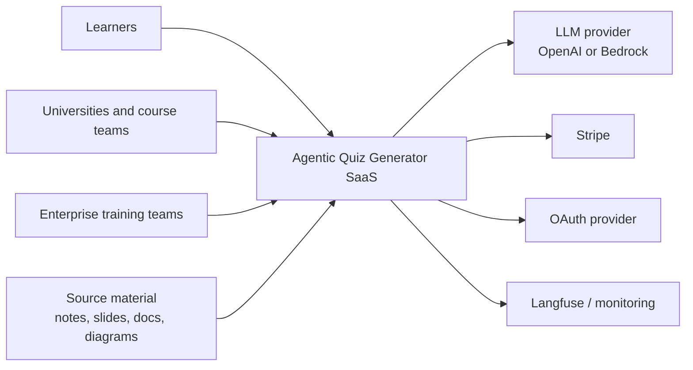
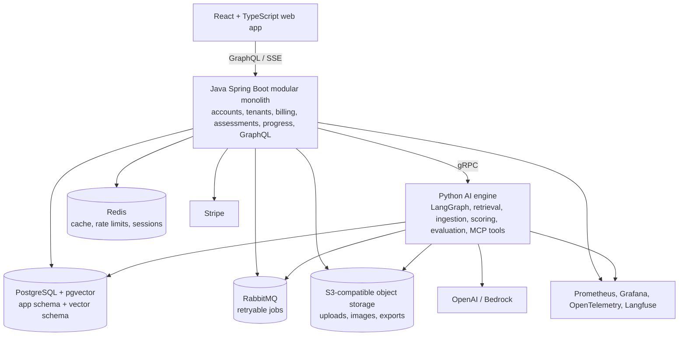
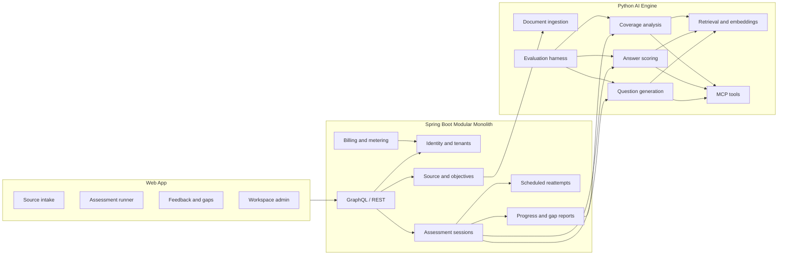
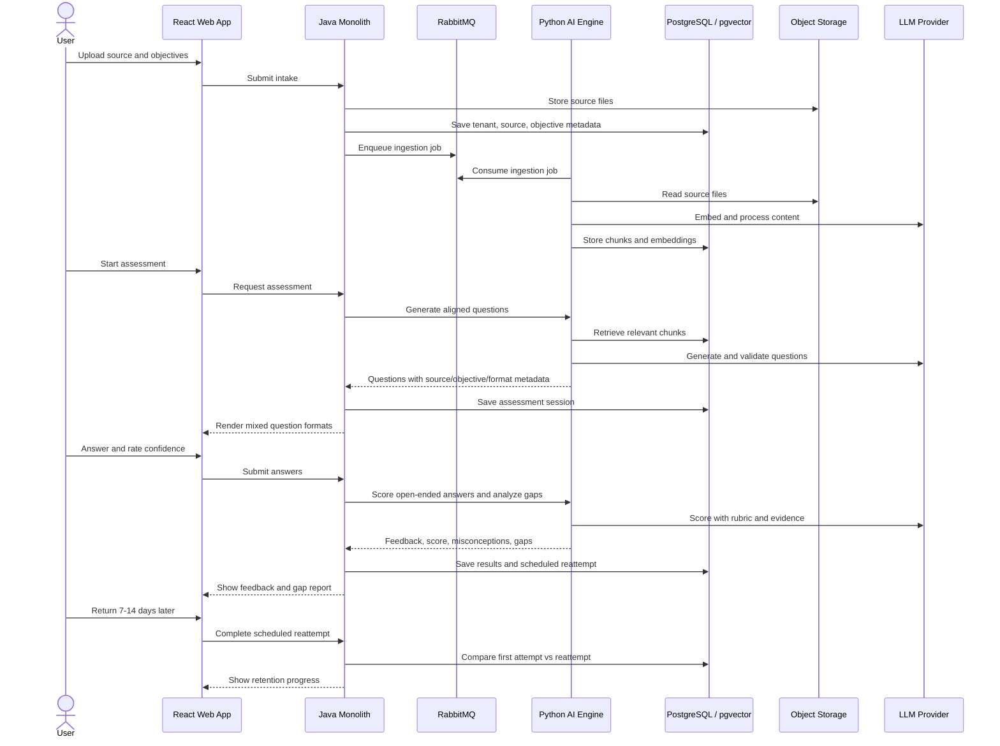

# Architecture Description

Date: 2026-06-28

This describes the target architecture for Agentic Quiz Generator as a retention-focused assessment SaaS.

## System Context

Users bring trusted learning material and objectives. The product turns them into assessments, feedback, scheduled reattempts, and gap reports. External systems handle identity, billing, model calls, and observability.

## Containers

The Java monolith owns product state and tenant boundaries. The Python engine owns AI work. They share the PostgreSQL cluster but not table ownership: Java owns app data, Python owns vector and AI working data.

## Components

The core modules keep SaaS rules in Java. The AI engine returns generated questions, scores, explanations, retrieval evidence, and coverage findings. The monolith decides what becomes visible to users.

## Data Flow

The key learning event is the scheduled reattempt: the user answers later, not rereads. Progress and gap reports are based on source-aligned answers over time.

## Architecture Decisions

- [ADR-001](./adr/adr-001-retention-first-learning-loop.md): Retention-first learning loop.
- [ADR-002](./adr/adr-002-system-architecture.md): Modular monolith with Python AI engine.
- [ADR-003](./adr/adr-003-contract-first-interfaces.md): Contract-first interfaces.
- [ADR-004](./adr/adr-004-data-and-background-work.md): PostgreSQL, Redis, pgvector, and RabbitMQ.
- [ADR-005](./adr/adr-005-assessment-quality-and-ai-evaluation.md): Assessment validity and AI evaluation gates.
- [ADR-006](./adr/adr-006-security-tenancy-and-billing.md): Security, tenancy, and billing.
- [ADR-007](./adr/adr-007-observability-and-slos.md): Observability, SLOs, and AI tracing.
- [ADR-008](./adr/adr-008-delivery-and-infrastructure.md): Docker Compose, ECS, Terraform, and CI gates.
